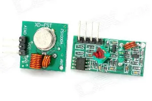
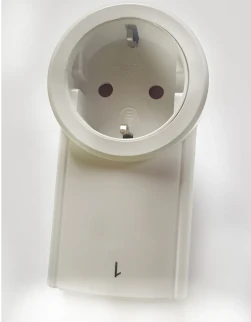

# rpirf
 A library to send `433mhz` signals from a Raspberry Pi

Protocol and logic ported from https://github.com/milaq/rpi-rf
# Supported Hardware
## Sender
Most generic 433/315MHz capable modules connected via GPIO to a Raspberry Pi will work with this library.
The picture below displays a unit which has been tested.



## Outlets / Sockets
Most generic 433mhz remote controlled outlets do work.
The picture below displays a outlet which works with the sender and library.



The library has been tested on following outlets from a *Raspberry Pi 3b* and a *Raspberry Pi 2b*, both running *Raspbian Lite*.


# Limitations
As of now (*March 14 2022*), the library does not support receiving (*sniffing*) signals in order to send them later.

However, I can strongly recommend a Python library by [milaq/rpi-rf](https://github.com/milaq/rpi-rf), which supports sending as well as receiving data.

However, the go *rpirf* library is only supposed to support sending.

# Installation / Setup

To install the library in your current go project, *go get* it using following command:
```
go get github.com/smarthome-go/rpirf
```
You can then import the library in your project using following code

```go
import "github.com/smarthome-go/rpirf"
```

# Getting started
## Creating a *new instance*
Before codes can be sent, the physical device must be set up and some basic parameters, for example *pulselength* or *protocol* must be set.

```go
device := rpirf.NewRF(17, 1, 10, 180, 24)
```

The following parameters describe
- the `BCM` pin number
- protocol to use
- How often each code should be sent (as redundancy)
- The pulselength
- The content length

## Sending codes
After the device has been set up, any `int` can be sent as a code.  
The `Send` method encodes the provided code to binary and sends it using the previously configured hardware.
```go
device.Send(5121438)
```
## Cleaning up
After all codes have been sent, it is recommended to clean the device
```go
device.Cleanup()
```
Make sure to implement proper error handling for the functions above.  
For a complete reference, take a look at the [Example](#example)

## Example
```go
package main

import (
	"github.com/smarthome-go/rpirf"
)

func main() {
	device, err := rpirf.NewRF(17, 1, 10, 180, 24)
	if err != nil {
		panic(err.Error())
	}
	if err := device.Send(123456); err != nil {
		panic(err.Error())
	}
	if err := device.Cleanup(); err != nil {
		panic(err.Error())
	}

}
```
